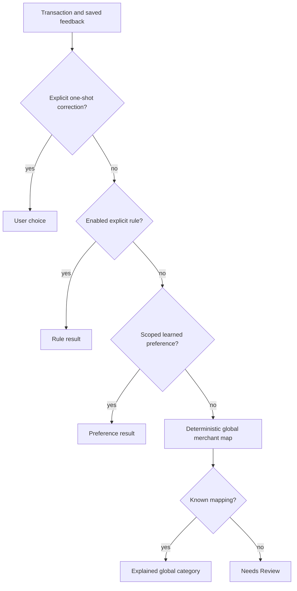

# Classification, feedback and optional AI

**Date:** 2026-10-02 · **Status:** Accepted deterministic first implementation; models and vendor calls deferred.

## Precedence and engine contract

DECISION: classification takes immutable scoped transactions, explicit rules, scoped merchant preferences and one-shot corrections and returns category/source/review/provenance. It performs no arithmetic with floating-point, no provider calls and no background learning outside the user's chosen scope. FACT: the [current domain](../../packages/domain/src/index.ts) defines `user`, `rule`, `preference`, `global`, `review` sources. Source evidence: [AI research](../research/raw/ai-ml-transaction-intelligence.md), [product brief](../BRIEF.md), [privacy](../compliance/privacy-model.md).

A direct correction locks this transaction; an explicit rule governs future matching transactions. If a direct transaction override and rule disagree, the override is the more specific explicit user decision and should remain visible. Equal-priority overlapping rules need deterministic ordering and conflict indication. A merchant preference never outranks an enabled explicit rule. Future high-confidence personalised model goes below preferences and above the global tier only after evaluation; LLM is a suggestion tier below proven deterministic results.

## Taxonomy, merchants and learning

CanonicalCategory is stable internal meaning; Category/Subcategory is a user's presentation and custom mapping. Current skeleton ships a fixed Italian category catalogue; user create/rename/merge/archive workflows are designed but deferred. When implemented, merge is a versioned migration of links/rules with audit and undo; archive preserves historical labels and references. Never rename a semantic identifier to mean something else.

Normalisation uses deterministic Unicode folding and whitespace/punctuation rules for a lookup key while preserving the original description. A known alias is evidence, not a universal ownership claim. Exact merchant keys are preferable to unrestricted substring matching. Merchant website, MCC, country, logo and chain attributes carry a source/date and remain unknown when not supplied. Do not invent logos or locations from a model guess.

Structured feedback types: correct, wrong category, merchant rename, transfer, refund, duplicate, recurring, subscription, ignore and split. Current persistence supports category `once` and `merchant` scope; other types need endpoint/storage/versioned tests. A one-shot correction affects only that transaction. Merchant scope creates an explicit scoped preference, with a preview that it can affect future similar transactions. Contextual/rule scope is offered only when implemented. Replay reads saved feedback first and never treats a provider update as permission to erase it. Avoid global model training from user corrections without a documented separate purpose and permission.

## Confidence and automation modes

DECISION: `confidence` in deterministic mock output is a heuristic rating plus evidence, not measured accuracy. No statement of '99% correct' from these scores. Future calibration partitions merchant/source/provider/account/kind, with train/evaluation separation by user/merchant and temporal holdout; precision and coverage are published together. Strong evidence may auto-apply; ambiguous candidates go to review. Avoid forcing an unknown merchant into a fashionable taxonomy merely to reduce review volume.

AUTOPILOT/BALANCED/CONTROL are designed policies, not current fully implemented modes. They can change suggest-vs-auto thresholds for eligible decisions; they cannot relax tenant isolation, financial invariants, sticky corrections or legal consent. Every action is explainable and reversible. Explanation comes from actual applied rule, source map or evidence code, not an LLM story written after the result.

## Future AI port and minimisation

Designed tiers: explicit rules → deterministic enrichment → cached known merchant map → small evaluated model → embeddings → small LLM → frontier only for measured unresolved cases → human review. Each tier must demonstrate added utility, calibrated error and a budget. No external AI endpoint is needed or enabled in the walking skeleton. Financial chat is future: it calls authorised deterministic tools and uses their exact outputs; it never performs raw-ledger arithmetic.

A future `ClassificationProvider` port accepts a minimal permitted-purpose DTO, returns a validated candidate/category/evidence, and never receives account identifiers, IBANs, balances or entire transaction history. Merchant/description text can expose health, religious or political data even after name redaction; pseudonymisation is not anonymity. Sensitive descriptions should remain deterministic/local unless a reviewed lawful purpose, permission, DPA/transfer/residency/retention controls and DPIA justify disclosure. Provider 'EU endpoint' or 'zero retention' marketing is not contract evidence.

Version model/prompt/schema and keep only allowlisted latency/token/cost/result metadata. No prompt text or raw payload in application logs. Cache scoped outputs with input digest and version; deletion invalidates caches. Prompt injection in descriptions cannot invoke tools or change precedence: untrusted content stays data, constrained output is validated, and suggestions lack authority to mutate records.

## Evaluation and release evidence

Meaningful tests: explicit rule beats preference/global; one-shot remains sticky after replay; merchant scope remains within profile; unknown merchant enters review; rename preserves original; duplicate/pending/transfer eligibility is respected; exact amounts are untouched. Future evaluation adds audited category accuracy, abstention, calibration, correction and undo rates with denominators and per-stratum uncertainty. Lack of correction is not ground truth. Real-bank beta must review strong-identifier quality and privacy even if mock tests pass. See [observability](observability.md) and [ADR-0010](../adr/0010-ai-architecture-and-provider-abstraction.md).
