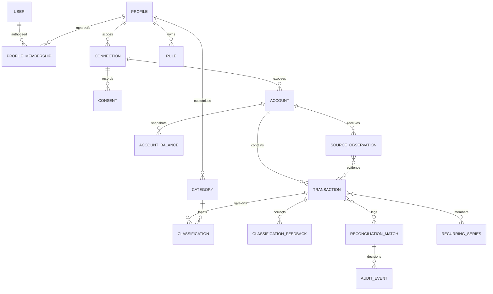

# Provider-independent domain model

**Date:** 2026-10-02 · **Status:** Accepted design. Only entities used by the walking skeleton need storage now; the catalogue is an evolution plan.

## Types, ownership and exactness

DECISION: a `Profile` is the financial tenant. IDs are opaque strings/UUIDs, not authorisation secrets. Every financial entity has `profileId`, creation/update instants and a revision where mutable. User membership is checked server-side; a client-supplied profile never grants access. Household membership may grant explicit shared-profile access, never automatic access to personal profiles. Shared bank accounts have a single financial identity in a shared profile; household reporting must not sum multiple representations of one account.

Money uses `Money { amountMinor: bigint; currency: CurrencyCode }` from [money](../../packages/money/src/money.ts). Scale comes from the versioned currency exponent table; never assume two decimal places. Database BIGINT has a range guard; JSON uses signed integer strings. `originalAmount`, `accountAmount`, and optional `reportingAmount` are separate values. FX record has integer numerator/denominator (or exact decimal string), source, effective date, retrieval time and explicit rounding. Account balances are snapshots with their type and `asOf`; imported movement totals never fabricate a current bank balance.

`bookedDate`/`valueDate` are validated real Gregorian `YYYY-MM-DD` dates as supplied by the source. `authorisedAt`, `observedAt` and event instants are UTC timestamps. `profile.timeZone` defaults to `Europe/Rome` for views, not a blanket timezone for every source. Store an actual source zone/offset when known; never invent a time for date-only data. Unsupported currencies/dates quarantine visibly.

## Entity catalogue

Fields below are minimal semantic fields, not a promise that all tables exist.

| Entity | Principal fields and invariant | Scope / stage |
| --- | --- | --- |
| User | identity subject, locale, status; no bank credentials | Identity; production auth later |
| Profile | owner/membership, displayName, timezone, reportingCurrency | Current tenant boundary |
| Household / Membership | invitation, role, explicit sharedProfile grants | Future; personal profiles remain separate |
| FinancialInstitution | provider key, institution key, name, supported capabilities | Provider metadata; no promised coverage |
| Connection | profile, provider, institution, externalRef, state, lastSyncAt | Mock now; encrypted token ref later |
| Consent | connection, purpose/scope, source consent ref, granted/expiry/revocation events | Mock consent marked synthetic; legal records later |
| Account | connection, external account ref, type, currency, alias, masked identifier | Current; ownership/reference scoped |
| AccountBalance | account, amount, type, asOf, source | Current snapshots |
| SourceObservation | connection/account/provider key, status, source reference, payload digest, observedAt, mapped fields | Immutable ingestion evidence |
| Transaction | account, observation refs, amounts/dates, status, merchant display/original text, revision | Stable canonical identity |
| Merchant / MerchantAlias | normalised name, raw alias, known evidence; no invented logo/location | Deterministic mapping now |
| Counterparty | optional encrypted name/account identifier plus provenance | Collect only fields needed for matching |
| CanonicalCategory | stable semantic key, income/expense/transfer kind | Internal taxonomy |
| Category / Subcategory | profile labels, parent, colour/icon, canonical mapping, archive state | User taxonomy; no destructive history loss |
| Tag / TransactionTag | profile tag, transaction links | Future; tenant-scoped links |
| Rule | priority, structured predicate, action, enabled/version | Explicit user rules outrank inference |
| Classification | transaction/revision, category, source, provenance, supersedes | Current derived result |
| ClassificationFeedback | transaction, correction kind, selected scope, before/after, actor/version | Sticky user choice; replay input |
| UserPreference | merchant/context preference, scope, explicitness/version | Learned only from chosen scope |
| AIRecommendation | candidate output, evidence/model/prompt, permitted purpose, expiry | Future; no external calls now |
| ReconciliationMatch / TransferMatch | type, scoped leg IDs, state, provenance, decision revision | Reversible relationships |
| Transfer | accepted internal relationship, currency amounts and explicit FX if necessary | Relation, not fabricated new spending |
| RecurringSeries / Subscription | member IDs, type/frequency, expected amount/range/date, confidence | Suggestion now; cancel status user-controlled |
| Budget / BudgetPeriod | category scope, exact target/currency, date interval | Future; no currency-mixed totals |
| Receipt / Document | purpose, object reference/digest, extraction state, TTL, transaction links | Deferred; minimisation required |
| ImportJob | file digest/schema, mapping, stage/checkpoint, failures | Deferred; multiset identity preserves repeated rows |
| SyncJob / SyncCursor | connection/account, status, run id, source cursor, checkpoint, error code | Current orchestration; durable worker later |
| Insight / Goal | deterministic inputs/calc version, amounts, explanation or target | Summaries now; goals later |
| Notification | semantic payload, permission, delivery state | Future; no sensitive push contents |
| AuditEvent / LedgerEvent | actor/action/subject/revision, provenance, inverse/supersedes | Business audit; never raw payload in logs |

`PendingTransaction` is a transaction state, not a second independently counted expense table. Source observations may include both pending and booked records; a canonical relationship links them only with sufficient evidence. Original source versions remain intact within retention; canonical rows have revisions rather than pretending banks never correct data.

## Lifecycles and invariants

DECISION: source status `pending → booked → reversed`; cancellation or expiry of pending is distinct from proven booking. Bank correction creates a new observation and canonical revision. Refund is a separate positive transaction plus `REFUND_OF` link, never a negative rewrite of the purchase. Connection `created → awaiting_authorisation → active → expired/error → active`, and `active → revoking → revoked`; mock skips real authorisation but says so. Consent expiry, SCA validity and API-token expiry are distinct source facts. Reconciliation `proposed → accepted/rejected → undone/superseded`; replays respect rejections and locks.

Each automated change records decision ID, input IDs/revisions, algorithmVersion, optional modelVersion/promptVersion, confidence with evidence basis, reason code/explanation, timestamp, actor and inverse/supersession. Scores are estimates until calibration, not numeric proof. Undo removes derived counting/category effects with revision checks; it does not delete or alter source observations. Replay must retain explicit user choices and not recreate rejected relationships unchanged.

Financial invariants: duplicate accepted representations count once; pending is separate from booked spending; internal transfer/card settlement move money between controlled accounts without new expenditure; split child allocations sum exactly to parent in one currency and parent never counts twice; linked refunds net only the proven allocated amount; cash ATM transfer requires an explicitly tracked cash wallet; unknown cards or missing legs stay reviewable. Shared reimbursements remain income/outflow facts until a user allocation is known. Multiple currencies are shown separately without a verified FX rate.

Safety is testable through exact-money tests, tenant-crossing attacks, replay/idempotency tests, repeated-purchase adversarial fixtures, pending/booked corrections, refund/split conservation, undo and sticky-feedback assertions. See [reconciliation](reconciliation-engine.md) and [security](../security/security-architecture.md). Sources: [reconciliation research](../research/raw/reconciliation-and-data-model-patterns.md), [privacy](../compliance/privacy-model.md), [consent](../compliance/consent-model.md). HYPOTHESIS: this model covers the first Italian pilot; actual provider payloads may require additional source references without changing financial invariants.
