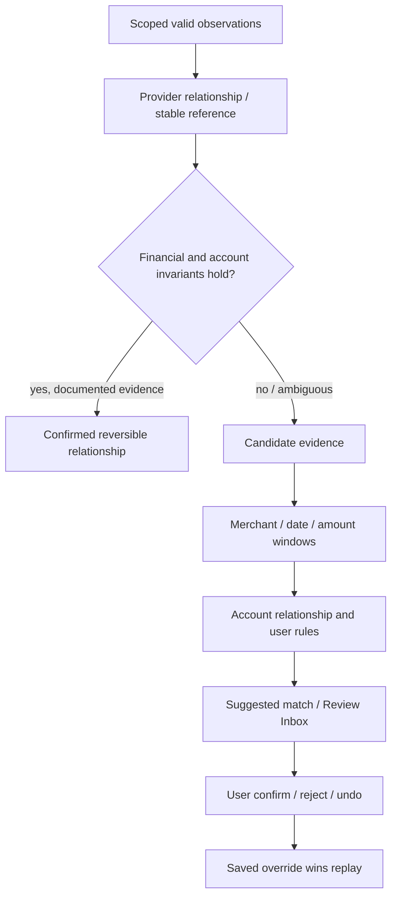

# Reconciliation engine

**Date:** 2026-10-02 · **Status:** Accepted conservative deterministic design.

## Goal and boundaries

DECISION: explain relationships between source records without rewriting original money. The engine is pure: accounts + transactions + saved match overrides → matches, review items and eligibility for deterministic summaries. It does not fetch provider data, mutate a database, call AI or infer account ownership from an arbitrary name. [Domain types](../../packages/domain/src/index.ts) use match states `confirmed`, `suggested`, `rejected`, `undone`. Accepted in the domain design maps to `confirmed` in the implementation.

FACT: [raw research](../research/raw/reconciliation-and-data-model-patterns.md) finds inconsistent pending/booked IDs and provider semantics. DECISION: hierarchical matching is a risk filter, not permission to force a match at the last tier.

## Evidence hierarchy and relationship rules

| Relationship | Strong evidence / invariant | Weak evidence action |
| --- | --- | --- |
| Pending → booked | Explicit related transaction ID or stable provider reference on same scoped account, currency/sign consistent | Amount/date/merchant similarity suggests; tips/FX can change amounts; never silently discard unmatched pending |
| Duplicate representation | Stable transaction/source reference for same underlying account, exact financial facts, one-to-one match, known cross-source representation | Same-day same-price merchant purchases remain separate; suggest only |
| Internal transfer | Two controlled accounts, opposite exact amounts in same currency, explicit reference/account relationship, no contradictory leg | Different currencies need FX evidence; inferred account ownership or missing leg needs review |
| Card settlement | Known current/card account relationship, matching payment legs and source reference | Generic 'carta' text does not prove settlement; preserve source facts |
| Refund | Explicit original link, same currency/account direction, allocation no greater than unrefunded debit | Merchant similarity alone suggests; unrelated credit remains income until decided |
| Cash ATM → cash wallet | User tracks an authorised cash account and explicit paired wallet leg | Withdrawal alone reduces bank cash; no invented wallet balance |
| Split | User allocations in one currency sum exactly to parent; parent suppressed only in allocation views | Reject inconsistent sum; never erase parent observation |
| Shared/reimbursement | Explicit user allocation and reimbursement relation; gross vs personal spend documented | Do not infer who owes what from description or household membership |

Initial implementation focuses on pending/booked, duplicate, internal transfer, card settlement, refund and cash transfer. Split and reimbursement remain designed and require persistence/API tests before claiming implemented. Recurring pattern, statistical model, embeddings and LLM may supply future candidate evidence after evaluation; none overrides financial constraints or user decisions. External AI is disabled now.

Provider references are evidence only if scoped and documented; opaque matching strings without account/currency/sign/type checks are insufficient. Distinct stable provider IDs and conflicting references weigh against duplicate inference. Multiple plausible legs produce review rather than greedily choosing one. Fuzzy windows are configuration evaluated on synthetic/consented labelled data, not a hardcoded certainty score.

## Provenance, accounting and undo

Each match has deterministic ID, type, leg IDs, state, algorithmVersion, evidence codes, explanation and confidence. A number is a heuristic score until calibration; the explanation cites the actual reference/relationship rule without exposing secrets. Persistence adds timestamp, actor, input revisions and prior/after state. A match uses one profile; references cannot point across tenants. Accepted duplicates have one designated counted representative; a pending record never becomes a second booked expense.

DECISION: summaries distinguish bank balance snapshots from spending flows. Confirmed internal transfer/card settlement/cash transfer do not create spending; confirmed duplicate representations count once; pending has a separate total. Linked refunds net allocated spending under an explicit refund-date policy, not silently rewriting history. Unlinked positive credits stay income or needs review. Never mix currencies, create missing balances or claim closing balance equals partial fetched history.

Undo stores `undone` with expected revision and recomputes affected summaries. Rejected and undone decisions survive replay; new algorithm outputs cannot immediately reconfirm them without changed evidence and a new visible proposal. Undo does not delete observations or make a provider transaction disappear. Mutation authorization and revision conflicts belong to the application/repository boundary, not the pure matching function.

## Scenario catalogue

| Scenario | Required outcome |
| --- | --- |
| Pending→booked same ID / changed ID with explicit relationship | One booked expenditure; pending distinguished; evidence shown |
| Pending tips/FX amount changes / no stable reference | Review; preserve facts and no unsafe merge |
| Provider retry + page overlap + changed payload | No extra expenditure; revision only for changed source |
| CSV+bank duplicate with reference / without reference | Strong link accepted / weak candidate reviewed |
| Two identical café purchases and multiple refund candidates | Both purchases remain; ambiguity is reviewable |
| EUR transfer / cross-currency transfer | Zero spending effect / require conversion evidence |
| Card settlement / unknown external card | Exclude proven internal settlement / do not fabricate card leg |
| Partial/full/excess refund | Allocation exact; cumulative over-refund rejected or reviewed |
| Split / reimbursement / shared account | Conservation and explicit allocation; no tenant leak |
| ATM with/without tracked cash wallet | Proven transfer only when wallet exists; no invented net worth |
| Merchant rename, reversed source and deleted source | Preserve raw text; revision and dependent-link recomputation |
| Replay after correction/reject/undo | Manual choice wins; stable derived result |
| Large amounts, JPY/KWD, DST/date boundary | Exact bigint and calendar semantics |
| Consent expired, retry, negative balance, missing history | Honest stale/partial state; no silent skip |

Tests that pass in this repository establish only their covered scenarios. Calibration, real-provider fixtures, split/shared expenses, concurrent undo and unknown-ID reconnection require separate evidence before beta. See [classification](classification-engine.md), [pipeline](data-pipeline.md), [security](../security/threat-model.md).
