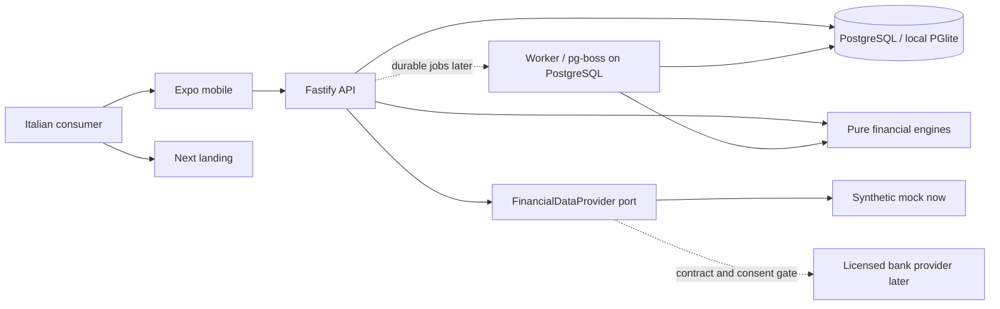
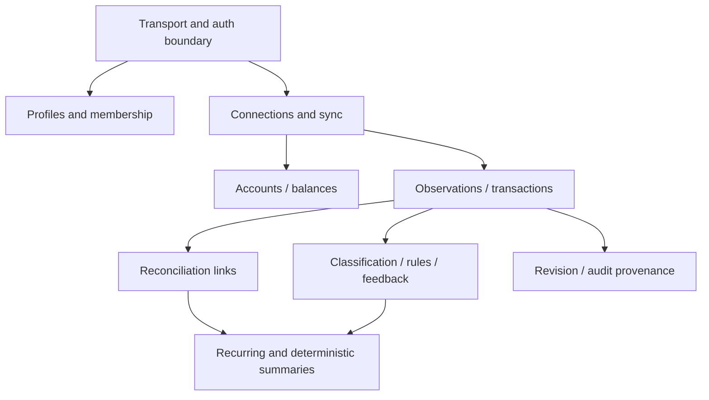
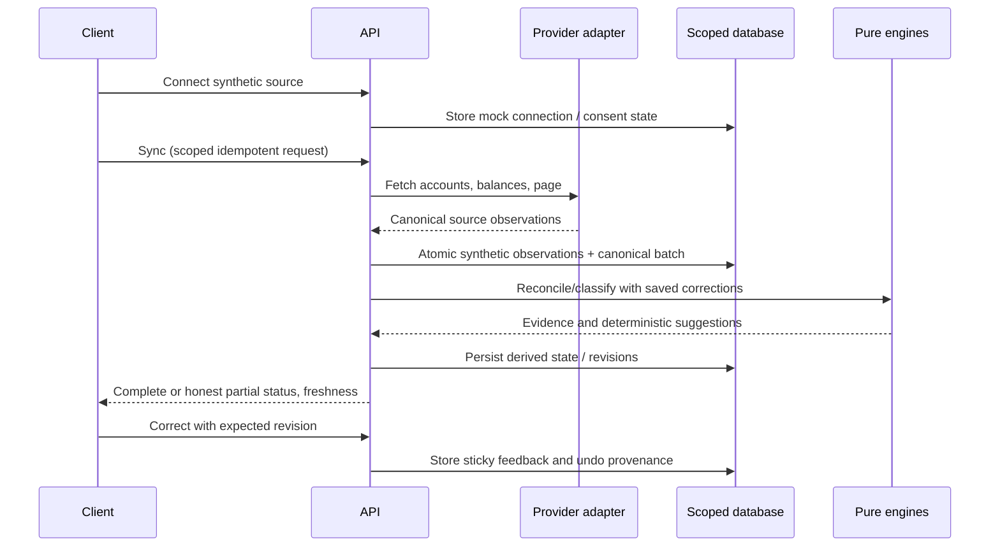

# System architecture and architecture decision

**Date:** 2026-10-02 · **Status:** Accepted design for a mock walking skeleton; real-bank beta separately gated.

## Evidence and release boundary

FACT: [the brief](../BRIEF.md) mandates exact money, provider independence, reversible inference and trust before automation. FACT: [historical spikes](../research/raw/toolchain-spikes.md) executed candidate packages but did not validate deployed security, passkey flows or production recovery. FACT: existing [money package](../../packages/money/src/money.ts) uses bigint with currency checks. The current repository and current commands supersede stale machine paths and versions in PROJECT_STATE or workflow scripts.

DECISION: a TypeScript pnpm/Turborepo monorepo with Fastify/Zod REST, PostgreSQL/Drizzle persistence, PGlite for deterministic synthetic dev/tests, pure financial engines, Expo mobile and Next landing. The implemented goal in this work is a functioning **mock-only** connect → sync → understand → correct → replay loop. No bank credentials, production sessions, payments or external AI are required to prove it. A real-user/real-bank beta is a distinct release requiring the [security gate](../security/security-architecture.md), provider contract/licensing review and privacy work. This architecture approval closes Gate D for that scoped design; Gate E for production remains open.

## Proposals, critique and counterproposal

Three alternatives are documented: [A boring](proposals/proposal-boring.md), [B modular](proposals/proposal-modular.md), [C cloud](proposals/proposal-cloud.md). These are contrasting architecture proposals authored in this pass, not evidence that an independent judge panel voted.

| Reviewer perspective | A: minimal | B: modular | C: managed cloud | Counterproposal adopted |
| --- | --- | --- | --- | --- |
| CTO | Fast, but synchronous work and weak seams can accumulate | Best correctness seams; too many empty modules would slow delivery | Small team would spend effort on IAM/deployment | B's boundaries with A's smallest executable slice; no empty modules |
| Security | Local mock needs no production credentials; real-data ops insufficient | Tenant discipline and provenance reduce likely leaks | Strong potential operations controls, unverified configuration risk | C's secrets/backup/restore requirements before real data, not speculative services now |
| Data | Must distinguish retry identity from duplicate inference | Observations, revisions and outbox support replay | Managed queue does not itself solve exactly-once effects | Use immutable source, tenant keys, revision checks, deterministic recompute and reversible links |

DECISION: choose B's domain boundaries, A's immediate service count, and C's explicitly gated real-data controls. Cost and development scores refer to a small team, not vendor performance benchmarks.

## Decision matrix

HYPOTHESIS: scores 1–5 (higher is better); weights total 100 and express the brief's priorities. Lock-in measures portability, so higher means less lock-in. Final scores include the counterproposal. Provider charges are excluded because UNKNOWN quotations can dominate costs.

| Criterion | Weight | A | B | C | Final | Final rationale |
| --- | ---: | ---: | ---: | ---: | ---: | --- |
| Development speed | 15 | 5 | 4 | 2 | 5 | Mock-first; bounded modules only |
| Type safety | 10 | 5 | 5 | 5 | 5 | Shared exact types, schema boundaries |
| Security | 15 | 3 | 4 | 5 | 4 | Tenant invariants; real-data controls are gated |
| Ecosystem | 6 | 4 | 4 | 4 | 4 | Node/React/Postgres; pinned stable compatibility |
| Testing | 10 | 4 | 5 | 4 | 5 | Pure engines + SQL + real-PG integration |
| Cost | 10 | 5 | 4 | 2 | 5 | No paid dependency for the mock |
| Observability | 6 | 3 | 4 | 5 | 4 | Allowlisted logs; instrument where useful |
| Mobile DX | 6 | 5 | 5 | 5 | 5 | Expo-compatible version set |
| Backend scalability | 6 | 3 | 4 | 5 | 4 | Worker seam and indexed database |
| Hiring Italy/EU | 4 | 4 | 4 | 3 | 4 | ASSUMPTION: React/TS familiarity |
| EU deployment | 6 | 4 | 4 | 4 | 4 | Portable EU deployment; contract still required |
| Low vendor lock-in | 6 | 5 | 5 | 3 | 5 | Plain PostgreSQL and provider ports |
| **Weighted score / 5** | **100** | **4.20** | **4.32** | **3.83** | **4.57** | Judgement, not measurement |

## Context and containers

The landing handles no financial payload. Mobile never holds provider secrets. The API authorises access before orchestrating scoped repositories. The same pure engines can run in tests and workers; they cannot call a vendor or database. A future worker runs the same codebase, not a separate microservice product.

## Sync and intelligence

Reconciliation: provider relationship → deterministic account/reference evidence → conservative candidates → review. Classification: explicit user correction/rule → learned scoped preference → evaluated model later → global deterministic map → suggestion → needs review. Descriptions never become executable instructions; source identity never equals proof of a duplicate. See [domain](domain-model.md), [pipeline](data-pipeline.md), [reconciliation](reconciliation-engine.md), [classification](classification-engine.md).

## Environments, delivery and scaling

DECISION: dev/test use synthetic fixtures and local PGlite; real PostgreSQL integration remains necessary for concurrent workers, role/RLS behaviour, migrations and pg-boss. Staging separates secrets/database and defaults synthetic. Real-bank beta and production require EU processor/residency assessment, reviewed auth, bounded access, encrypted backups and a tested restore. No environment is called production-ready from tests alone.

CI should execute install with lockfile, lint/format, typecheck, financially meaningful tests, real-PG integration and build. Secret scan and dependency audit need reviewed findings; a warning-only audit is not a production security gate. Deploy immutable artifacts with explicit migration review, health checks and rollback. Destructive schema changes follow expand/contract. Operational logs omit ledger content; metrics/alerts and target NFRs are defined in [observability](observability.md) and [NFR](nfr.md).

ASSUMPTION: reserve €100–350/month for small managed beta hosting/monitoring excluding AIS, support, store fees/tax/labour. Current local mock requires no service purchase. Actual vendor bills and AIS prices are UNKNOWN; [business cost model](../business/cost-architecture.md) governs scenario assumptions.

Scale in order: query indexes and profiling, bounded sync pages, asynchronous worker/outbox, multiple workers with leases and per-provider budgets, DB connection pooling, then measured read cache/queue isolation. Extract a module only for measured independent throughput or ownership requirements. A pure engine, repository port and provider adapter are extraction seams; no event broker or distributed saga is required now.

## Review log

| Finding | Resolution | Status |
| --- | --- | --- |
| Historical workflow conflates Expo SDK with latest RN and old paths | Current manifest/lockfile and current test evidence govern | Accepted |
| Queue and KMS presented as implemented because a spike exists | Implementation/production controls explicitly separated | Accepted |
| Universal 180-day expiry and four daily calls would mislead users | Provider metadata governs actual expiry, history and quota | Accepted |
| Fingerprint/merchant similarity can hide repeated purchases | Strong evidence or review; ambiguous candidates never auto-merge | Accepted |
| Tenant filtering alone can fail on references | Composite profile constraints plus adversarial API/DB tests required | Accepted |
| Live DEK deletion can be undone by a restored backup | Restore tombstones, bounded key copies and restore drill required | Accepted |
| External AI could leak descriptions and fabricate arithmetic | Disabled now; minimisation/evaluation gate; deterministic tools later | Accepted |
| Eighteen ADRs could imply eighteen services | Decisions do not mandate empty packages or service deployment | Accepted |
| Independent fintech/privacy reviewer: canonical fields confused with full raw payloadTTL | Split minimised canonical purpose/lifetime from short full-payload schedule | Fixed |
| Independent engine reviewer: refunds could refer to pending/reversed/excluded debits or override bounds | Added eligibility/cumulative guards and adversarial tests in implementation; final run evidence recorded by owner | Fix inspected |
| Independent API reviewer: source snapshot ordering/reconnection could double or downgrade facts | Implementation preserves/reactivates synthetic connection identity and serialises bounded collection; dedicated integration tests added | Fix inspected; final execution evidence by owner |

OPEN QUESTION: independent runtime security review must confirm implementation against this design before a real-data release. Scope-specific mock tests are evidence of the walking skeleton only.
